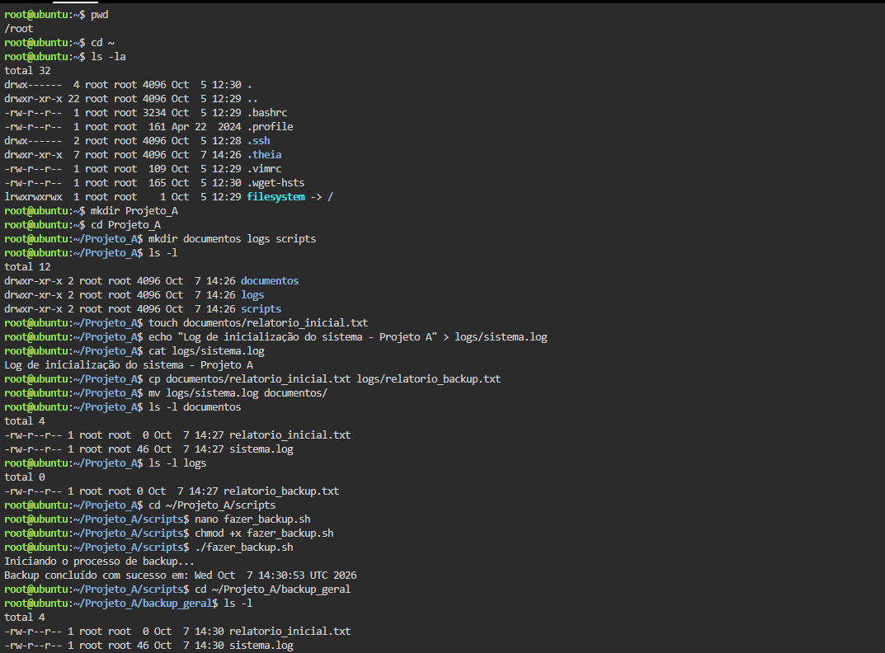

# Atividade 06 - Administração Linux

## Descrição
Prática de gerenciamento de diretórios, manipulação de ficheiros e automação com Shell Script em ambiente Ubuntu.

## Evidências da Execução
Captura de ecrã do terminal detalhando todos os passos seguidos na atividade:

